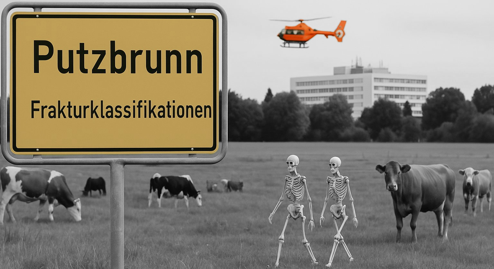

Willkommen zum Klassifikationskompendium á la Putzbrunn. Hier findet sich nach und nach das Sammelsurium der verschiedenen, in Putzbrunn gebräuchlichen, Klassifikationen von traumatologischen Verletzungen.

