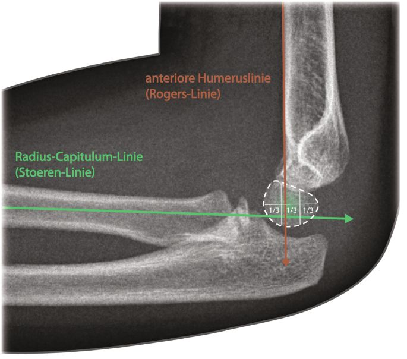

# Radiologische Hilfslinien	

## Vordere Humeruslinie (Rogers Linie)

- Läuft *normalerweise durch das mittlere Drittel des Capitulum humeri*
- Bei *suprakondylären Humerusfrakturen* häufiger Dislokation des Capitulum nach dorsal - *Vordere Humeruslinie schneidet im ventralen Drittel des Capitulum*

## Radiocapitellare Linie (Stoeren Linie)

- Hilfslinie, die als *Verlängerung des Radiusschaftes durch das Capitulum* verläuft
- *Hinweis auf Radiuskopfluxation* wenn die Linie nicht durch das Capitulum läuft
