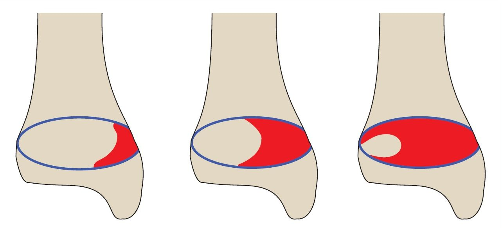
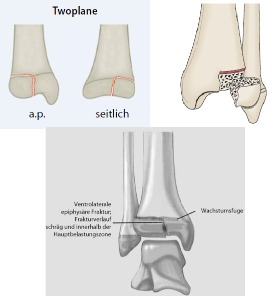
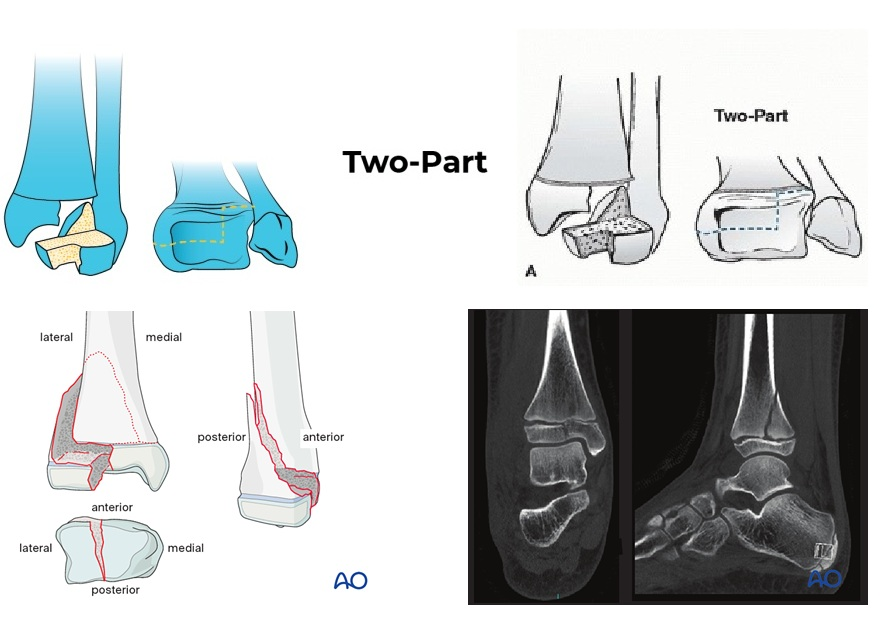
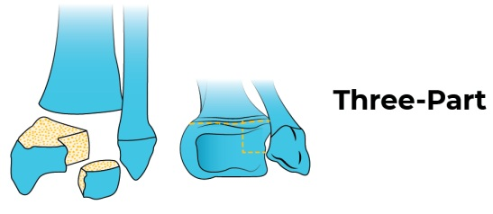
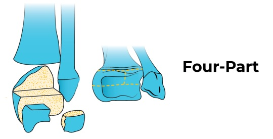

# Verschluss der Wachstumsfuge

Schluss der Wachstumsfuge von *medial* nach *lateral* 

# Two-Plane Fraktur

= Tilleaux-Fraktur --> rein epiphysär 

# Tri-Plane Fraktur

## Two-Part

= Tri-Plane I

## Three-Part

= Tri-Plane II

## Four-Part

