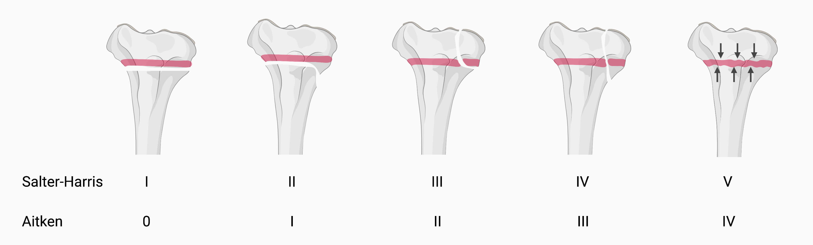

- Aitken 0 = Salter I: Epiphysiolyse ohne Begleitfraktur
- Aitken I  =  Salter II: Partielle Epiphysiolyse mit Absprengung eines metaphysären Elements.
- Aitken II = Salter III: Partielle Epiphysiolyse mit Epiphysenfraktur.
- Aitken III = Salter IV: Fraktur durch Epi- und Metaphyse.
- Aitken IV = Salter V: Kompressionsfraktur mit radiologisch darstellbarer axialer Stauchung der Epiphysenfuge