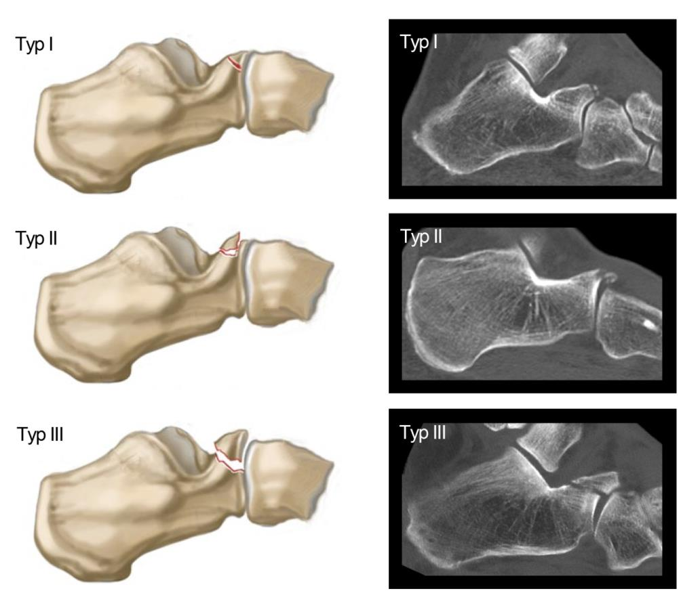

# Processus anterius calcanei (PAC)

### Degan-Klassifikation

- Typ I: nicht-dislozierte Fraktur, welche typischerweise die Spitze des PAC betrifft
- Typ II: dislozierte Fraktur, welche die Gelenkfläche nicht miteinschließt
- Typ III: große, dislozierte Fraktur, welche die Gelenkfläche des CC-Gelenk miteinschließt

