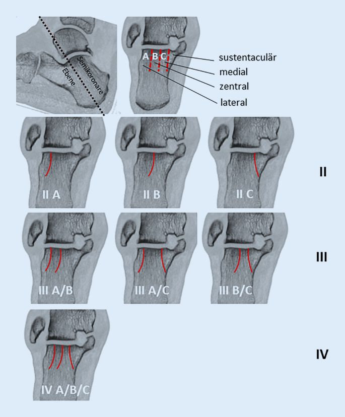
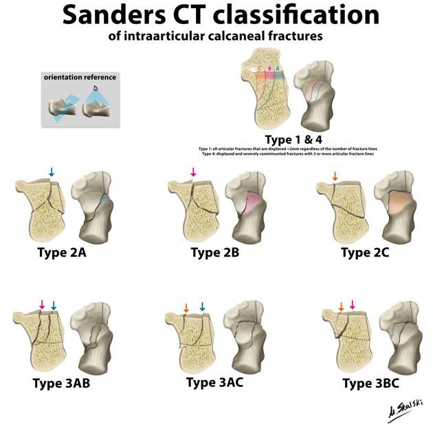

# Processus anterius calcanei (PAC)

## Degan-Klassifikation

- Typ I: nicht-dislozierte Fraktur, welche typischerweise die Spitze des PAC betrifft
- Typ II: dislozierte Fraktur, welche die Gelenkfläche nicht miteinschließt
- Typ III: große, dislozierte Fraktur, welche die Gelenkfläche des CC-Gelenk miteinschließt

# Artikuläre Clacaneusfrakturen

## Sanders slassifikation

- **type 1:** includes all intraarticular fractures that have less than 2 mm of articular displacement, regardless of the number of  fracture lines/fragments present
- **type 2a:** involves one primary fracture line that  courses through the lateral aspect of the posterior facet; the primary  fracture usually assumes a "y" shaped configuration as it exits medially and laterally out of the calcaneal body; this fracture is often  accompanied by one or more accessory fracture lines that do not involve  the posterior articular facet
- **type 2b:** involves one primary fracture line that  courses through the central aspect of the posterior facet; the primary  fracture usually assumes a "y" shaped configuration as it exits medially and laterally out of the calcaneal body; this fracture is often  accompanied by one or more accessory fracture lines that do not involve  the posterior articular facet
- **type 2c:** involves one primary fracture line that  courses through the medial aspect of the posterior facet and is  accompanied by a transverse fracture through the body of the calcaneus;  this fracture is often accompanied by one or more accessory fracture  lines that do not involve the posterior articular facet
- **type 3ab:** involves two primary fracture lines, one  coursing through the lateral aspect of the posterior facet and the  second through the central aspect; this subtype usually presents with  depression of the central fragment; the two primary fracture lines may  be accompanied by additional accessory fracture lines that do not  involve the posterior articular facet
- **type 3ac:** involves two primary fracture lines, one  coursing through the lateral aspect of the posterior facet and the  second through the medial aspect; this subtype usually presents with  depression of the central fragment. The two primary fracture lines may  be accompanied by additional accessory fracture lines that do not  involve the posterior articular facet
- **type 3bc:** involves two primary fracture lines, one  coursing through the central aspect of the posterior facet and the  second through the medial aspect; this subtype usually presents with  depression of the central fragment; the two primary fracture lines may  be accompanied by additional accessory fracture lines that do not  involve the posterior articular facet
- **type 4:** involves three or more primary fracture lines  with greater than 2 mm of articular displacement, and are therefore  severely comminuted

