# Femurkopf

### Pipkin Klassifkikation

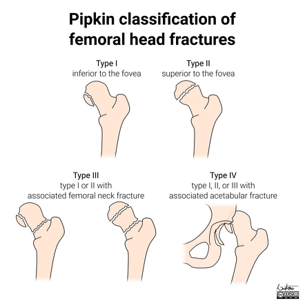

- **Pipkin I**: Fraktur der Kalotte kaudal der Fovea capitis femoris (außerhalb der Belastungszone)
- **Pipkin II**: die Fraktur der Kalotte zieht durch die Fovea capitis
- **Pipkin III**: Fraktur der Kalotte (Pipkin I oder Pipkin II) in Kombination mit einer medialen Schenkelhalsfraktur
- **Pipkin IV**: Fraktur der Kalotte (Pipkin I oder Pipkin II) in Kombination mit einer dorso-kranialen Pfannenrandfraktur

### AO-Klassifikation (31C)

- **C1**: reine Spaltung des Hüftkopfes
- **C2**: reine Impression des Hüftkopfes
- **C3**: gleichzeitiges Auftreten von zwei Frakturen

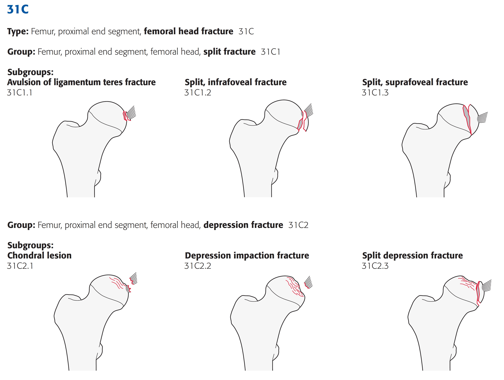

# Schenkelhals

### Pauwels-Klassifikation

Je nach Literaturquelle andere Gradzahlen. 

1. **Bild nach AO (in aktueller Literatur so aufgeführt, *ae. richtig*)**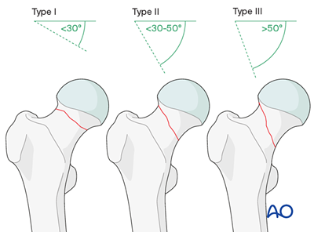
2. **Bild geistert in deutscher Literatur herum.**

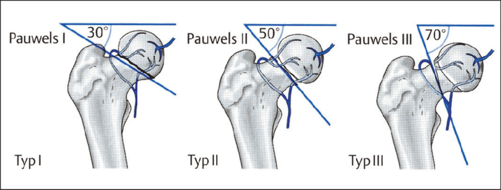

### Garden-Klassifikation

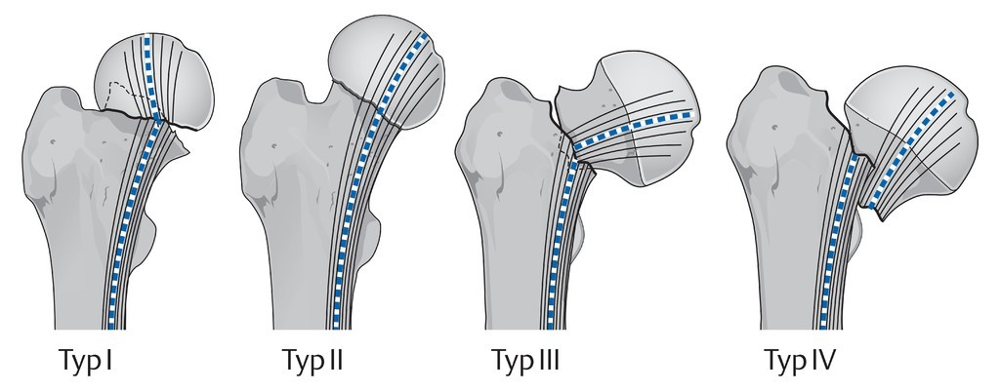

- **Garden I**: *Valgisch gestaucht*
  Die Fraktur ist inkomplett und gestaucht, daher stabil. Es besteht eine *Valgusstellung* des Schenkelhalses ohne Dislokation der Frakturfragmente. 
- **Garden II:**  *Axial gestaucht*
  Die Fraktur ist komplett, die Stellung der Fragmente zueinander ist stabil.
- **Garden III:**  *Varisch disloziert*
  Es besteht eine komplette Fraktur mit Dislokation der Fragmente. Der Femurschaft ist gegenüber dem proximalen Fragment rotiert und weist eine Fehlstellung  auf. Medial haben die Frakturfragmente trotz Dislokation noch Kontakt. 
- **Garden IV:**  *Komplett disloziert*
  Das proximale und distale Frakturfragment berühren sich an keiner Stelle, eine ausgeprägte Dislokation liegt vor. Der Hüftkopf verharrt in Nähe des Acetabulum. 

### AO-Klassifikation (31C)

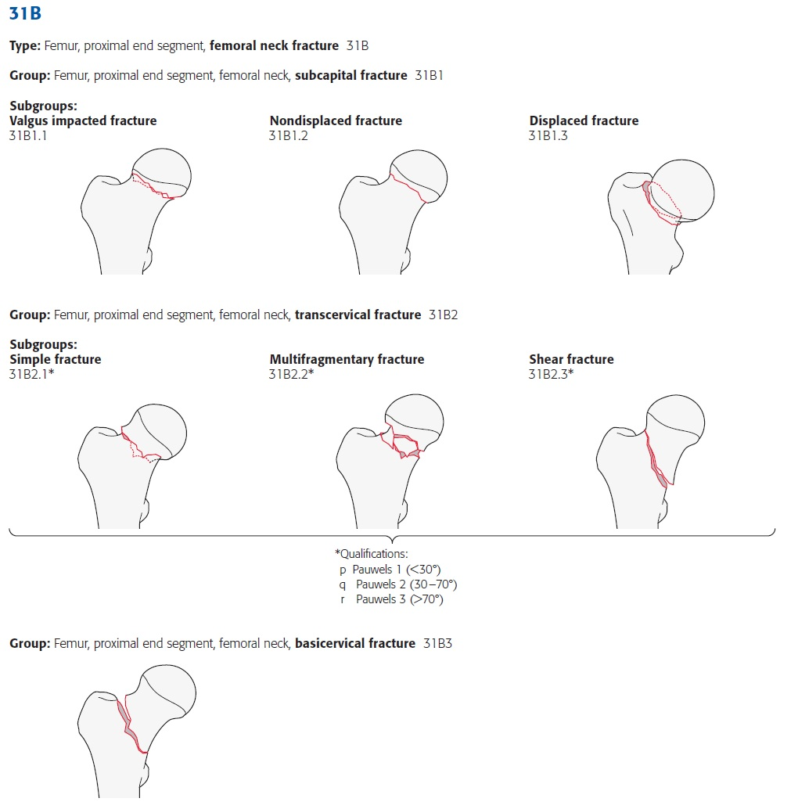

# Trochanterregion

### AO-Klassifikation (31A)

# Diaphyse

### AO-Klassifikation

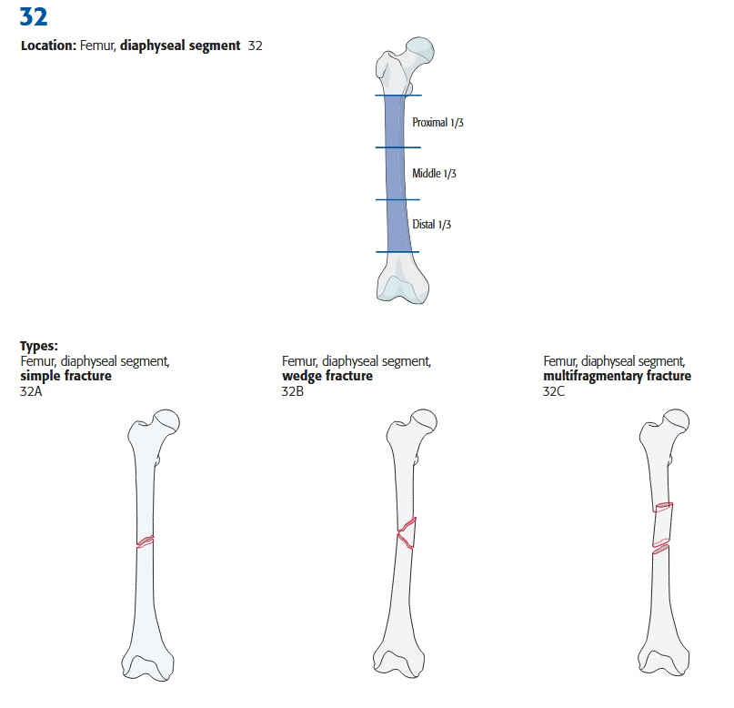

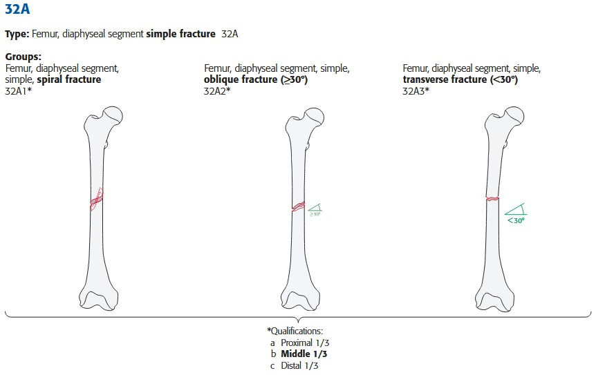

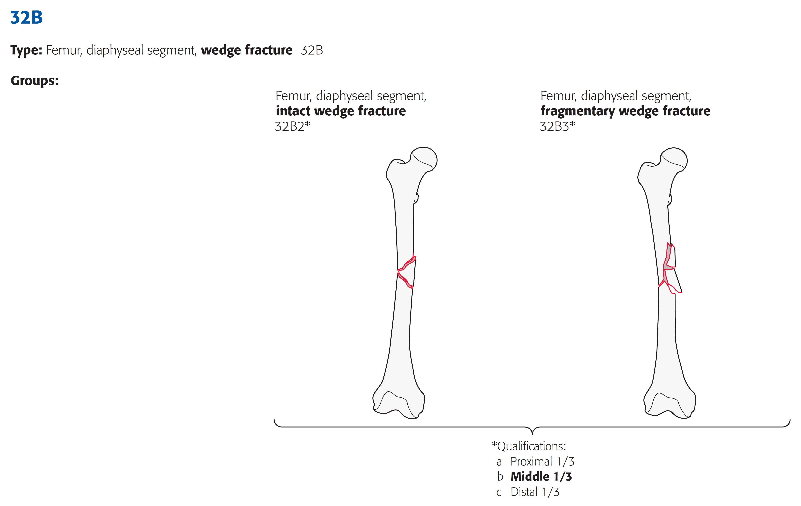

# Distaler Femur

### AO-Klassifikation

--> s. PDF-Auszug AO-Klassifikation [PDF-Auszug AO-Klassifikation 2018](assets/ao-klassifikation-2018_femur.pdf)

# Periprothetische Frakturen

## Proximaler Femur

### Vancouver Klassifikation

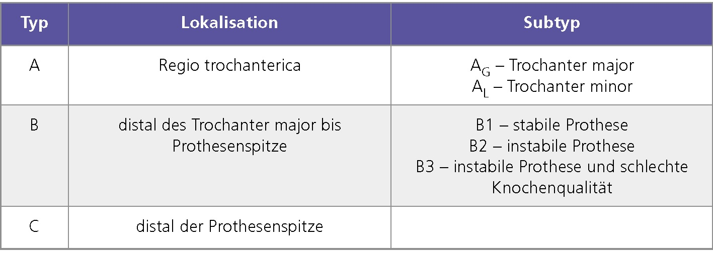

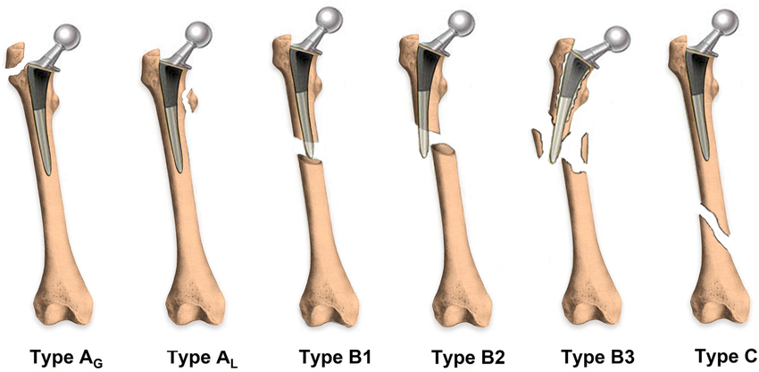

## Distaler Femur

### Rorabeck Klassifikation

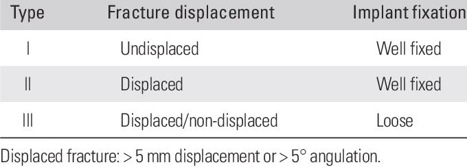

- **Typ I** *(Fraktur nicht-disloziert, Prothese fest)*

  - **Typ IA** Reponierbar, gute Knochensubstanz, stabile und gut alignierte Prothese Typ 

  - **Typ IB** Nicht reponierbar, gute Knochensubstanz, stabile und gut alignierte Prothese 

- **Typ II** *(Fraktur disloziert, Prothese fest)*
  Reponierbar/nicht reponierbar, ausreichende distale Knochensubstanz, Fehlposition oder lockere Prothese (# disloziert, Prothese fest)! 

-  **Typ III** *(Prothese gelockert bei dislozierter oder nicht-dislozierter Fraktur)*
  Reponierbar/nicht reponierbar, Fraktur mit erheblicher  Zertrümmerung, inadäquate Knochensubstanz 

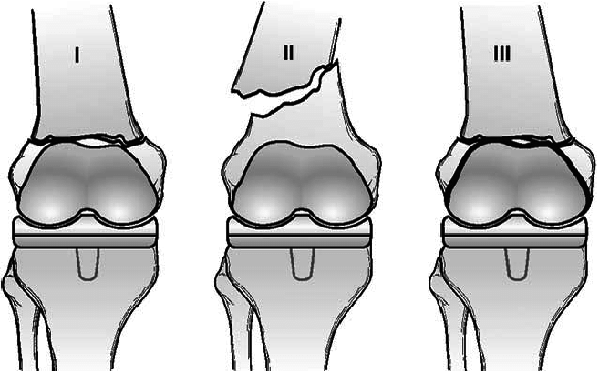

### Su Klassifikation

- **Typ I** Fraktur proximal der Prothese 
- **Typ II** Fraktur beginnt auf Höhe der proximalen Prothesenbegrenzung und verläuft nach proximal 
- **Typ III** Fraktur liegt distal der proximalen Prothesenbegrenzung 

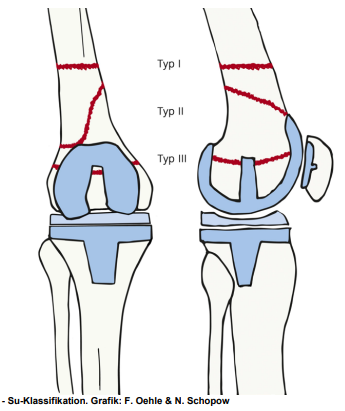

### Leipziger Klassifikation

**Fraktur:**

- **Typ I** Su Typ I 
- **Typ II** Su Typ II 
- **Typ III** Su Typ III 
- **Typ IV** Lewis/Rorabeck Typ III 

**Prothese:**

- **Typ A** Bicondyläre, ungekoppelte Endoprothese 
- **Typ B** Bicondyläre, teilgekoppelte, posterior stabilisierte Endoprothese 
- **Typ C** Geführte Endoprothese mit intramedullären Verankerungen 
- **Typ D** Distaler Femurersatz 
