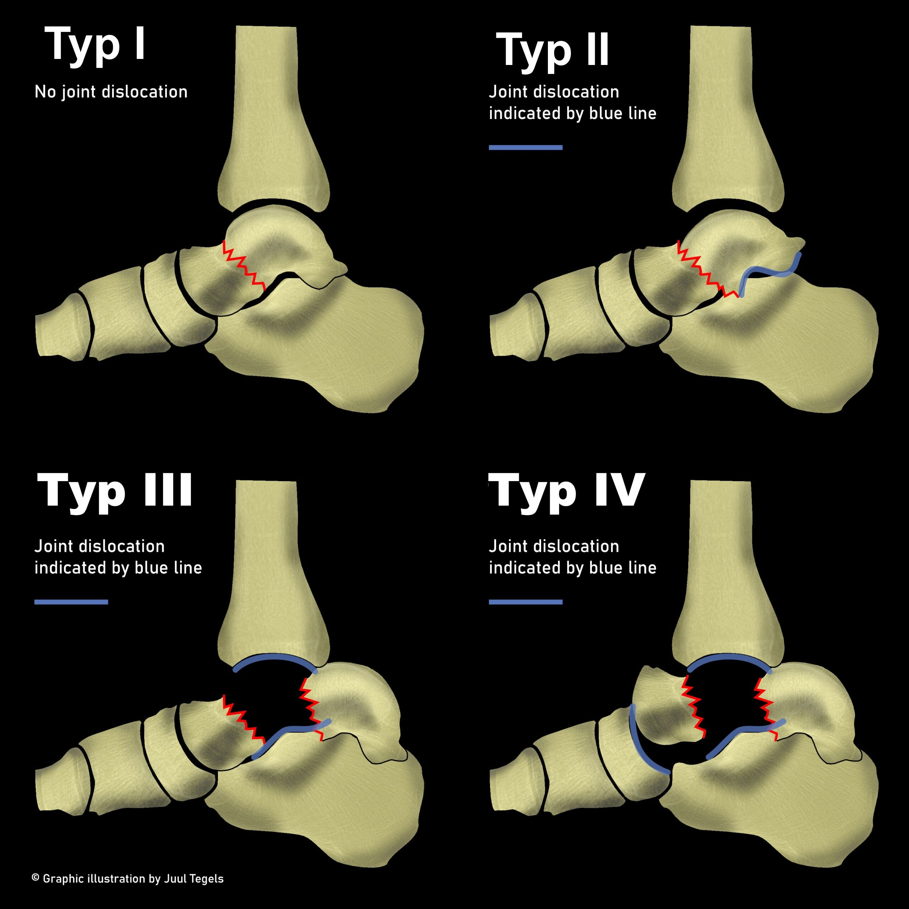
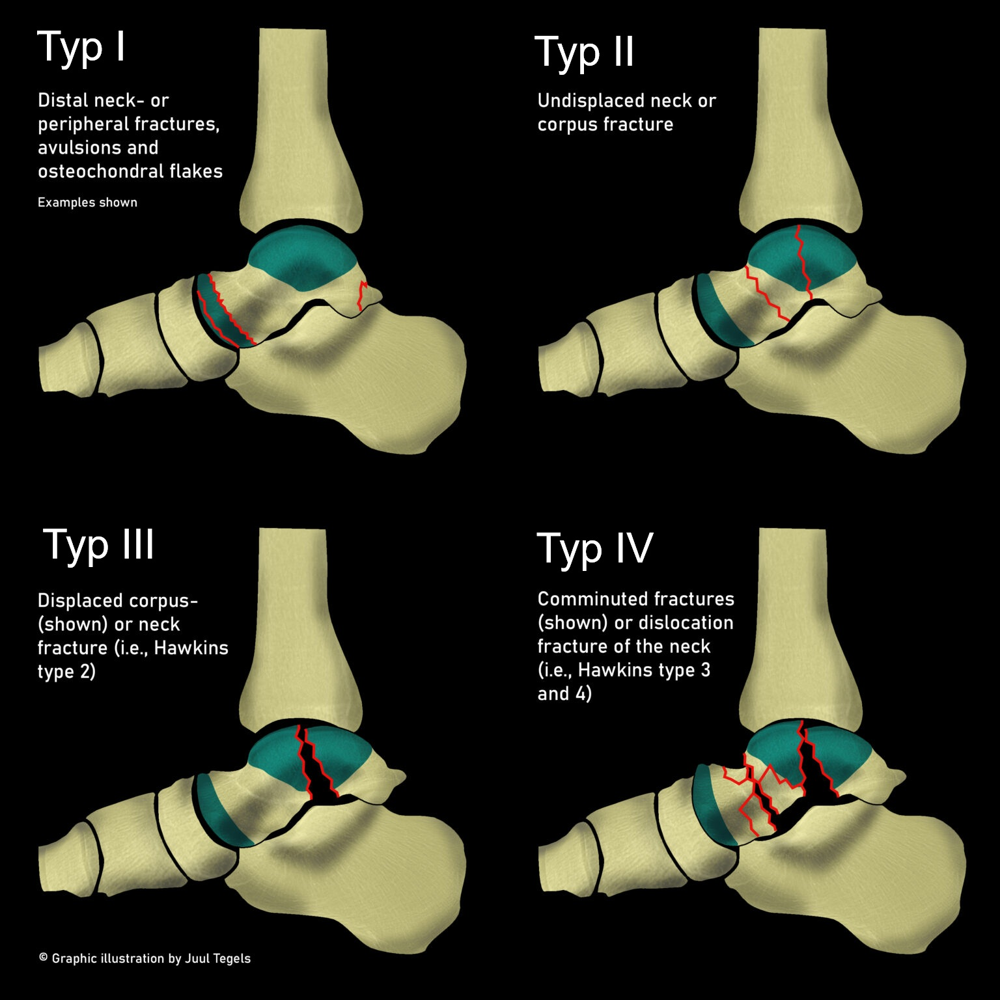

# Talus

## Talushals - modifizierte Hawkins Klassifikation

- **Typ I:** *Nicht-dislozierte* Fraktur des Talushalses
- **Typ II:** Fraktur des Talushalses mit *subtalarer* Dislokation
- **Typ III:** Fraktur des Talushalses mit *subtalarer und tibiotalarer* Dislokation
- **Typ VI:** Fraktur des Talushalses mit *subtalarer, tibiotalarer und talonavicularer* Dislokation

# Talus - Marti & Weber Klassifikation

- **Typ I:** Periphere Fraktur (Proc. fibulares, Proc. posterior, distaler Hals, Taluskopf)
- **Typ II:** Zentrale Fraktur **ohne** Dislokation (proximaler Hals, Taluskörper)
- **Typ III:** Zentrale Fraktur **mit** Dislokation (proximaler Hals, Taluskörper)
- **Typ IV:** Dislokationsfraktur (Proximaler Hals, Körper disloziert im OSG / Subtalargelenk)
