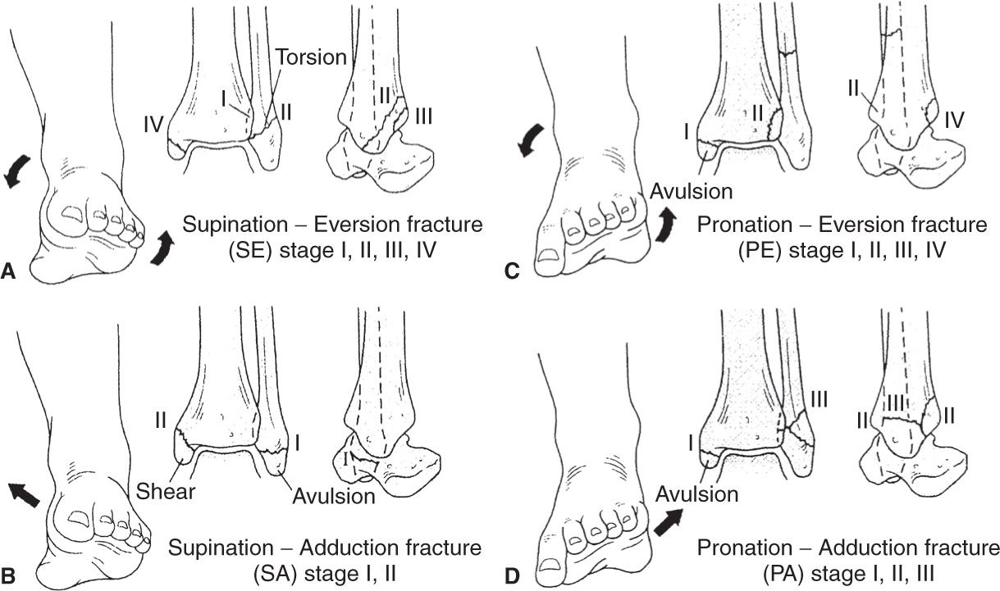
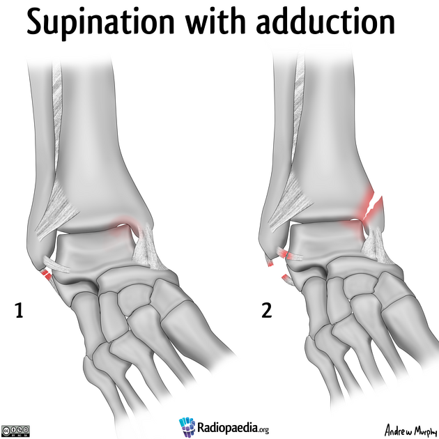
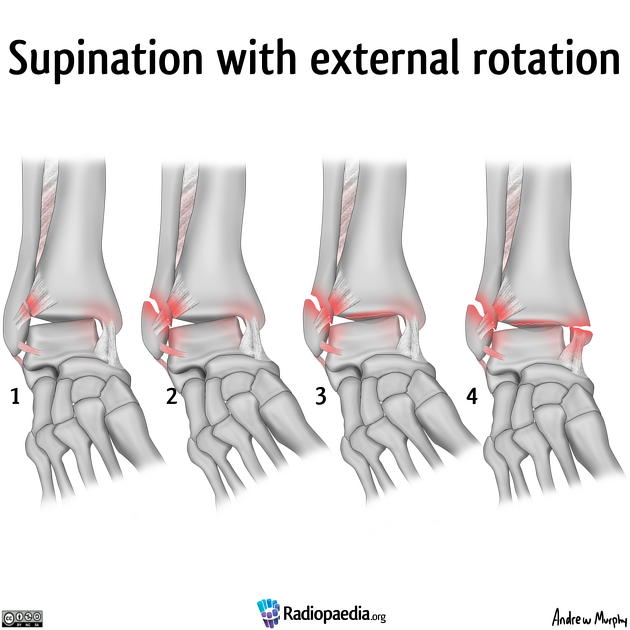
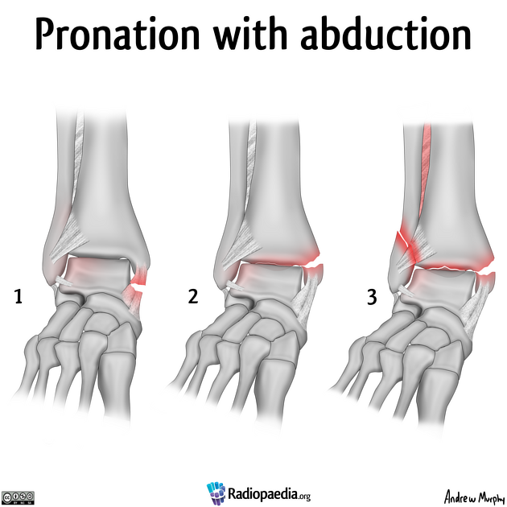
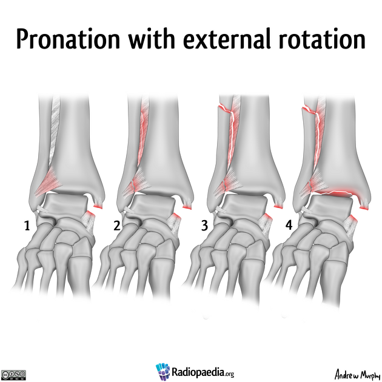
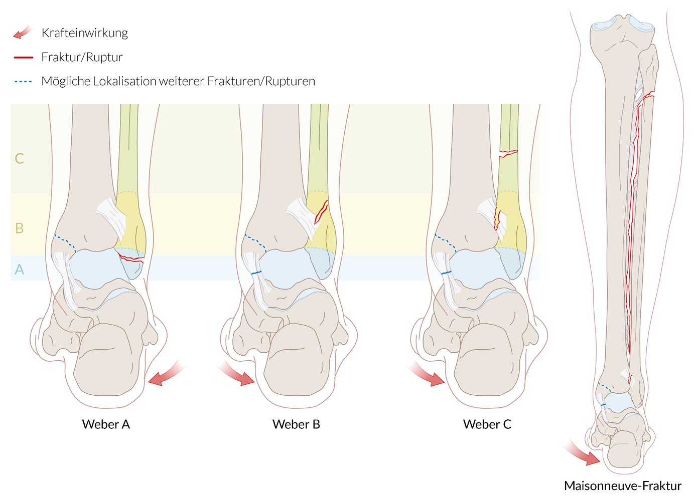

# Lauge-Hansen Klassifikation

Beste Darstellung auf [radiologyassistant.nl](https://radiologyassistant.nl/musculoskeletal/ankle/weber-and-lauge-hansen-classification) 🌟

## Supination-Adduktion

- stage 1: without medial malleolar fracture
- stage 2: with oblique or vertical medial malleolar fracture 

## Supination-Eversion (40-70%)

- stage 1: the anteroinferior tibiofibular ligament is torn or avulsed
- stage 2: the talus displaces and fractures the fibula in an oblique or spiral fracture, starting at the joint
- stage 3: tear of the posteroinferior tibiofibular ligament or fracture posterior malleolus
- stage 4: tear of the deltoid ligament or transverse avulsion fracture medial malleolus

## Pronation-Abduktion

- stage 1: deltoid ligament disruption or transverse medial malleolus fracture
- stage 2: posterior malleolus fracture
- stage 3: oblique fibular fracture above the level of the joint, in a low medial high lateral fracture plane

## Pronation-Außenrotation

- stage 1: deltoid ligament rupture, which may appear occult or as  medial mortise widening, or  transverse avulsion fracture of the medial  malleolus
- stage 2: involvement of the AITFL with extension into the [interosseous membrane](https://radiopaedia.org/articles/interosseous-membrane?embed_domain=hackmd.io%25252F%252540yIPUAFeCSL2JsU8smR5nJQ%25252Fbnjhjgjghjghjghfavicon.icofavicon.icoradiopaedia-icon-144.png&lang=us) results in widening of the distal tibiofibular distance
- stage 3: a spiral or oblique fibular fracture (>6 cm) above the talotibial joint
- stage 4: involvement of the posterior inferior tibiofibular ligament (PITFL), or posterior malleolus fracture 

# Weber-Klassifikation

- **Weber A:** unterhalb der intakten Syndesmose (blau)
- **Weber B:** auf Höhe der Syndesmose mit möglicher Läsion (gelb)
- **Weber C:** oberhalb der rupturierten Syndesmose (grün)

