# Tibiakopf

## Schatzker-Klassifikation

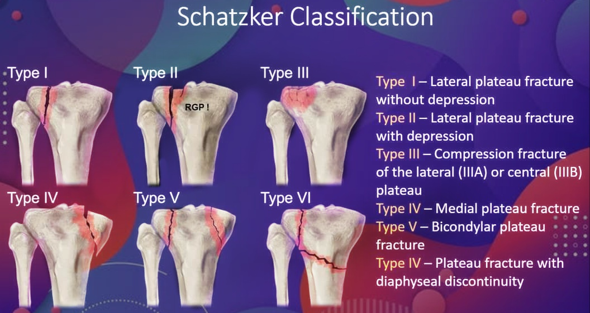

- **Typ I:** laterales Fragment 
- **Typ II:** laterale Fraktur mit Impression der Gelenkfläche 
- **Typ III:** Impression der lateralen Gelenkoberfläche
  - **Typ IIIa:** Laterales Plateau
  - **Typ IIIb:** Zentrales Plateau
- **Typ IV:** mediale Fraktur 
- **Typ V:** bikondyläre Fraktur 
- **Typ VI:** bikondyläre Fraktur mit Verlust der meta-diaphysären Lagebeziehung der Fragmente 

## AO-Klassifikation (41)

Details siehe [PDF Auszug Tibia](assets/tibia_ao-klassifikation.pdf) aus dem Kompendium 2018

- **Typ A:** extraartikulär 

- **Typ B:** intraartikulär, monokondylär (Schatzker 1-4) 
- **Typ C:** intraartikulär, bikondylär (Schatzker 5-6) 

### 41A

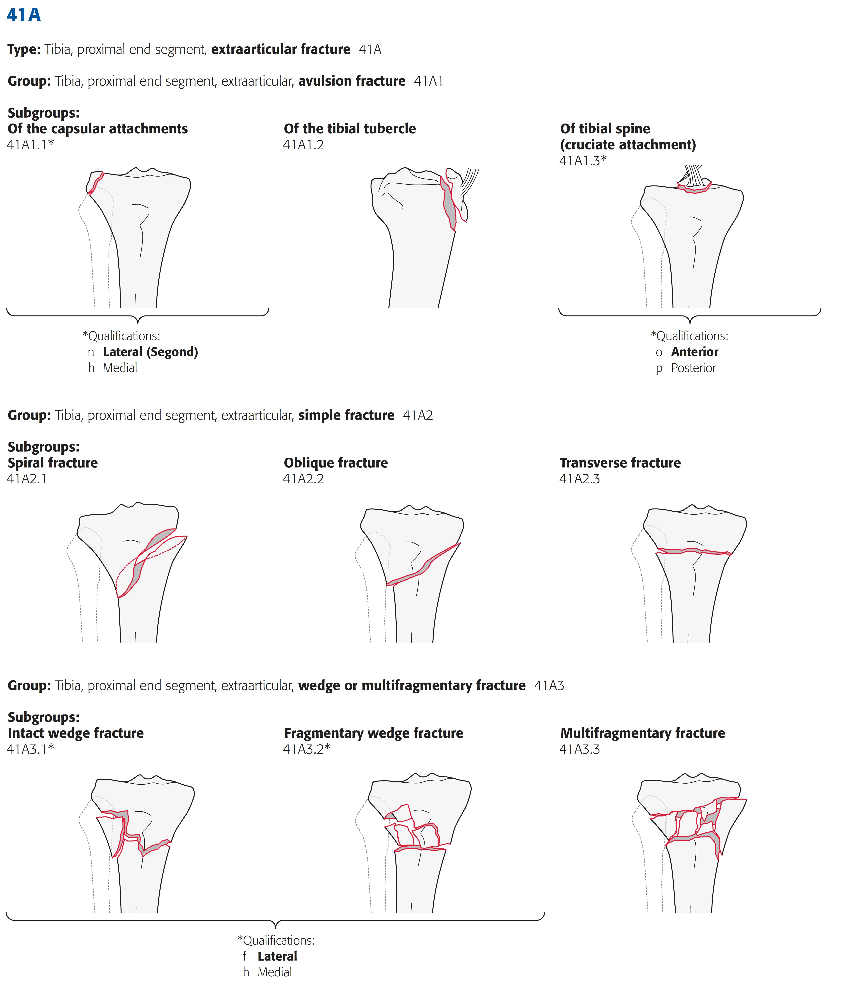

### 41B

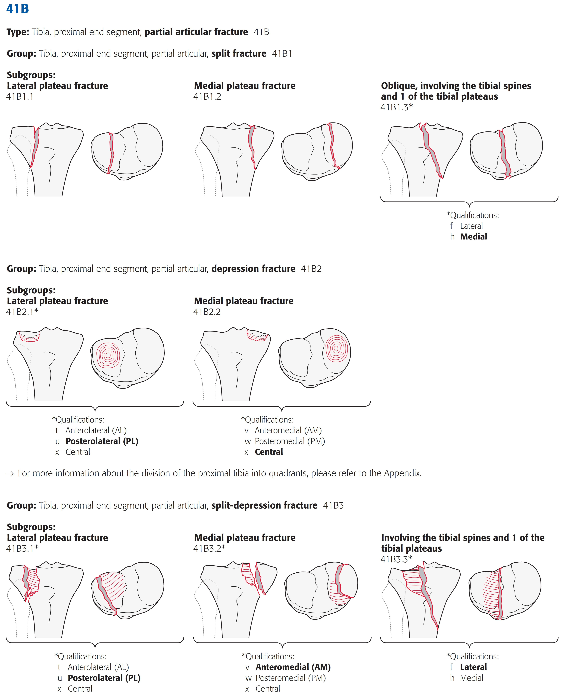

### 41C

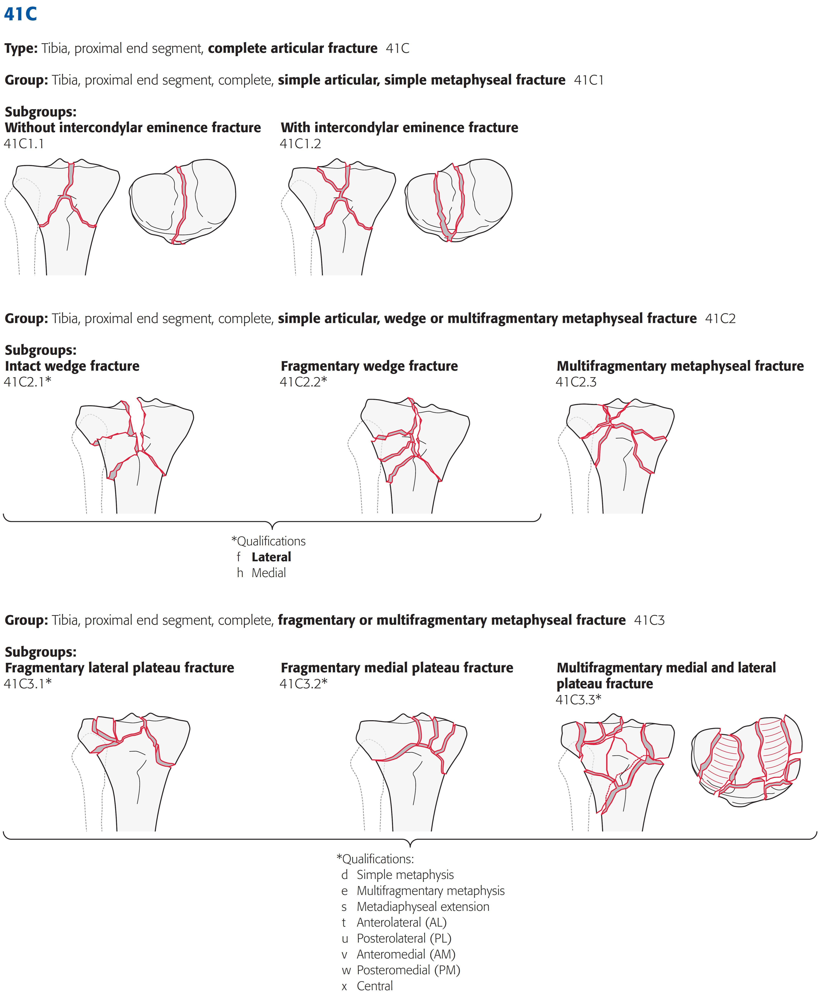

# Tibiaschaft

## AO-Klassifikation (42)

Details siehe [PDF Auszug Tibia](assets/tibia_ao-klassifikation.pdf) aus dem Kompendium 2018

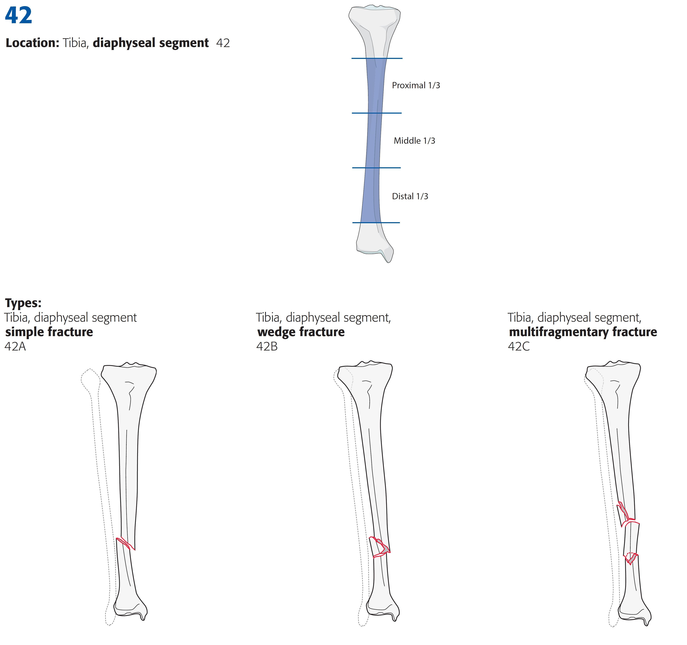

### 42A

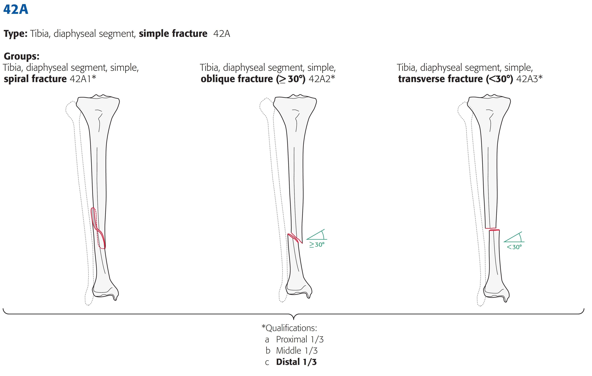

### 42B

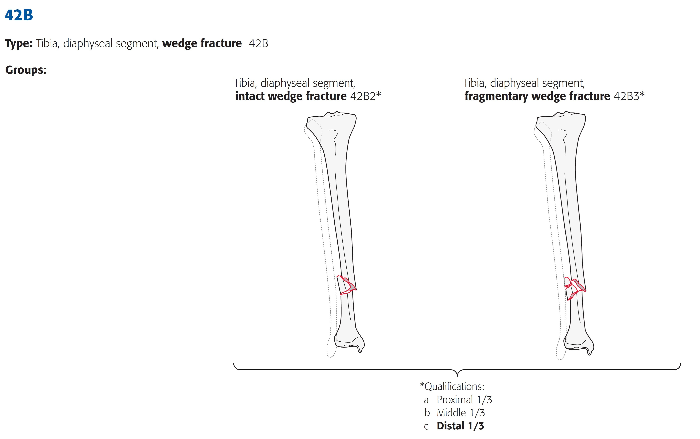

### 42C

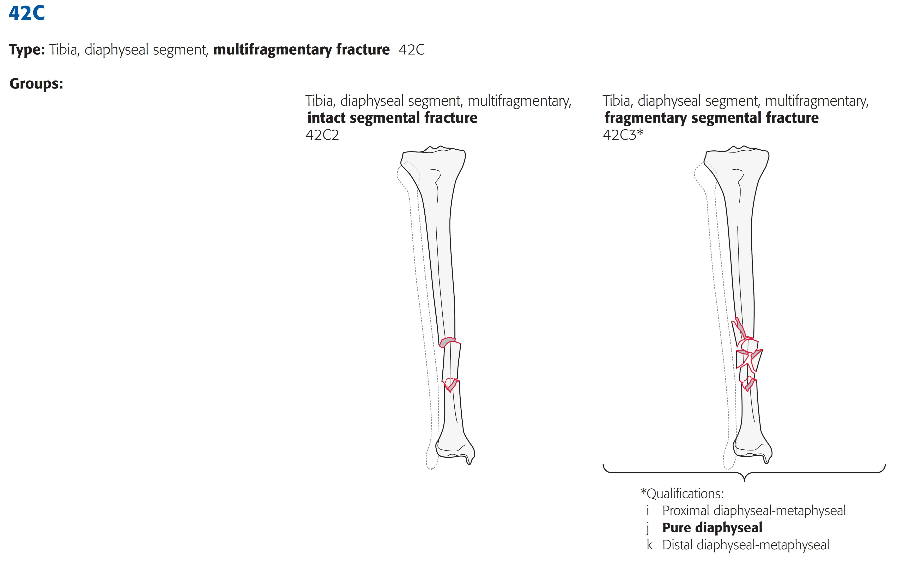

# Tibia distal

## AO-Klassifikation (43)

Details siehe [PDF Auszug Tibia](assets/tibia_ao-klassifikation.pdf) aus dem Kompendium 2018

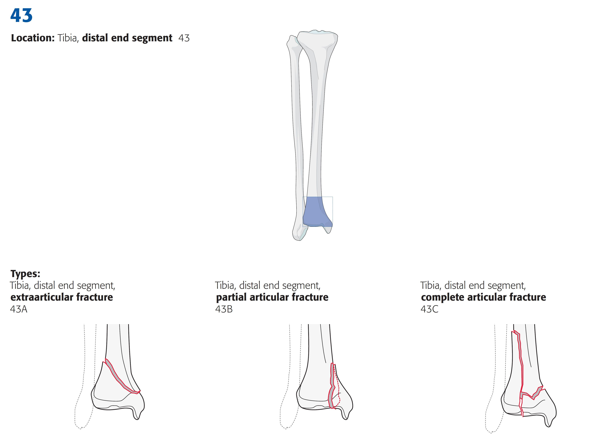

### 43A

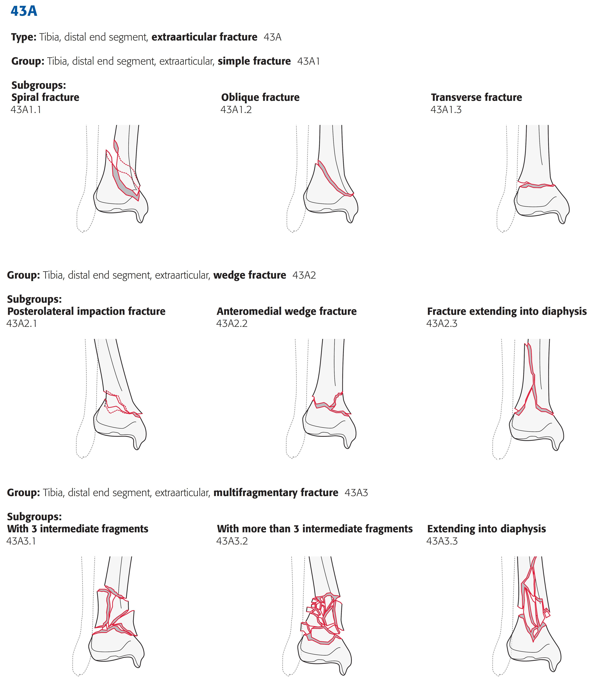

### 43B

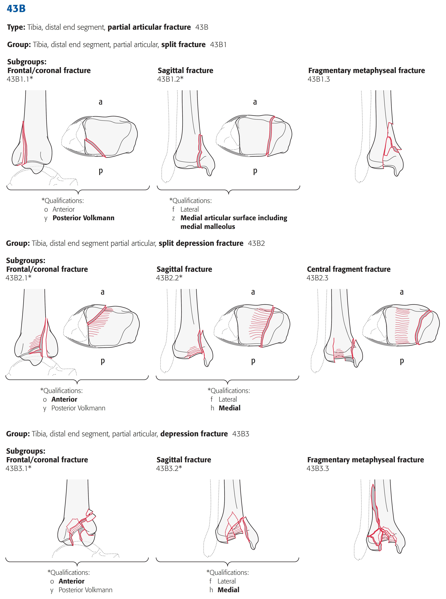

### 43C

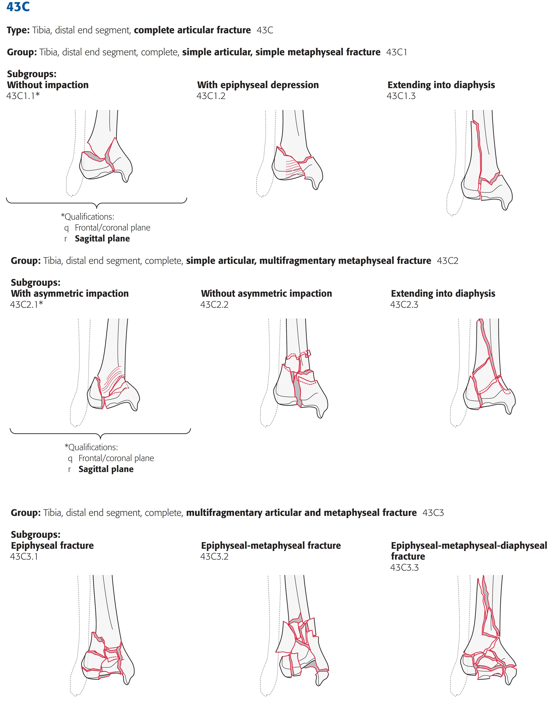

# Periprothetische Fraktur Tibiakopf

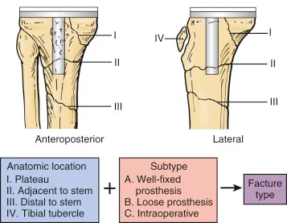

**Lokalisation**

- **Typ I:** Frakturen der Tibiakopfregion mit Kontakt zum Interface 
- **Typ II:** Frakturen im meta-/diaphysären Übergangsbereich 
- **Typ III:** Frakturen unterhalb der Tibiakomponente im Schaftbereich 
- **Typ IV:** Frakturen mit Verletzung des distalen Kniestreckapparats 

**Prothesenstabilität**

- **A:** Prothese stabil 
- **B:** Prothese locker 
- **C:** Intraoperative Fraktur 
