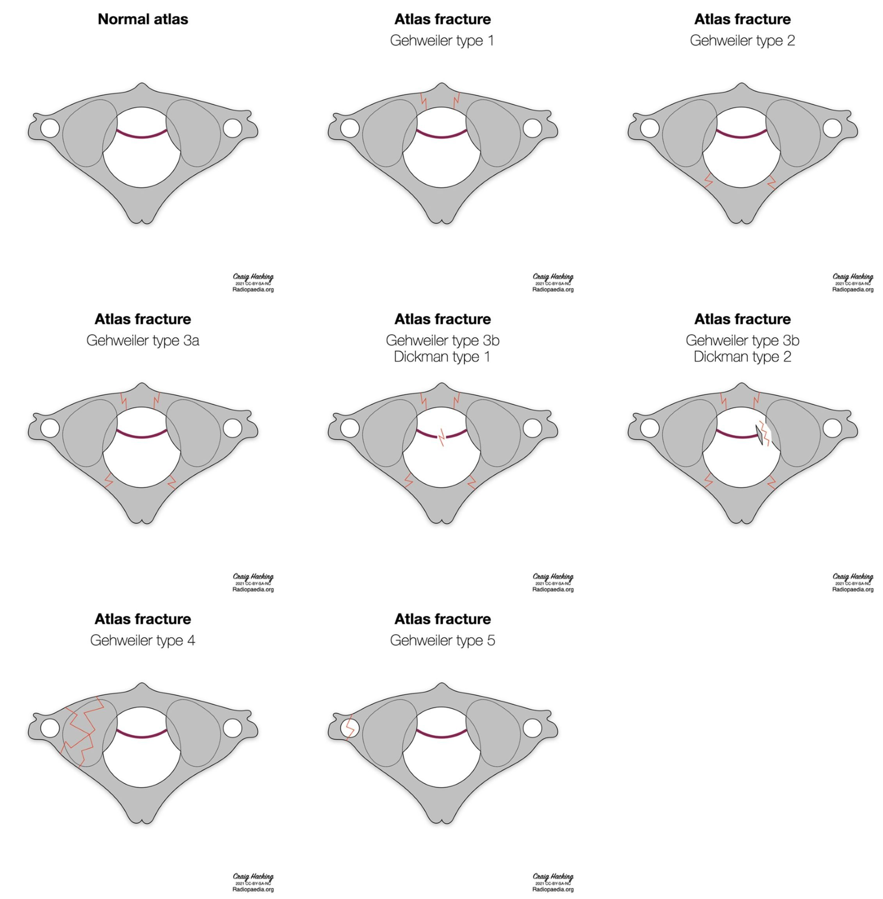
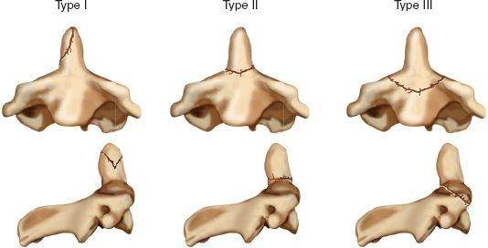

# Obere HWS

## AO-Klassifikation

## Atlas Frakturen

### Gehweiler / Dickman Klassifikation

- **Typ 1:** fractures of the anterior arch
- **Typ 2:** fractures of the posterior arch and are usually bilateral
- **Typ 3:** fractures involving the anterior and posterior arch (*Jefferson Fraktur*)
  - **Typ 3a:** intact transverse atlantal ligament
  - **Typ 3b:** disrupted transverse atlantal ligament complex
    - **Dickman Typ 1:** ligamentous disruption
    - **Dickman Typ 2:** bony avulsion with an intact transverse atlantal ligament
- **Typ 4:** fractures of the lateral mass
- **Typ 5:** isolated fractures of the C1 transverse process (rare)

## Densfrakturen

### Anderson & D'Alonzo Klassifikation

- **Typ I**
  - rare
  - fracture of the upper part of the odontoid peg (generally oblique)
  - above the level of the transverse band of the cruciform ligament
  - usually considered stable
- **Typ II**
  - most common
  - transverse course fracture at the base of the odontoid
  - below the level of the transverse band of the cruciform ligament
  - unstable
  - high risk of non-union
- **Typ III**
  - through the odontoid and into the lateral masses of C2
  - relatively stable if not excessively displaced
  - best prognosis for healing because of the larger surface area of the fracture

# Subaxiale HWS

