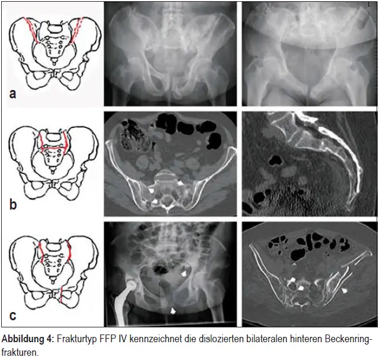

# FFP-Klassifikation

Fragility fractures of the pelvis (FFP)

- **Typ I: ** Isolierte anteriore Beckenringfrakturen ohne Beteiligung der posterioren Strukturen
  - **Typ Ia:** Einseitig
  - **Typ Ib:** Beidseitig
- **Typ II:** Nichtdislozierte Frakturen des hinteren Beckenringes
  - **Typ IIa:** isoliert dorsale Verletzung
  - **Typ IIb:** Kompressionsfraktur der vorderen Massa lateralis des Sakrums mit einer Instabilität des vorderen Beckenringes
  - **Typ IIc:** Unverschobene, aber vollständige Sakrumfraktur, Iliumfraktur oder iliosakrale Verletzung mit begleitender Instabilität des vorderen Beckenringes.
- **Typ III:** Komplette und dislozierte, einseitig posteriore Verletzungen mit hoher Instabilität
  - **Typ IIIa:** verschobene Iliumfraktur
  - **Typ IIIb:** verschobene unilaterale iliosakrale Ruptur
  - **Typ IIIc:** verschobene unilaterale Sakrumfraktur
- **Typ IV:** Bilaterale verschobene hintere Beckenringverletzungen mit/ohne gleichzeitiger Instabilität des vorderen Beckenringes
  - **Typ IVa:** bilaterale Iliumfrakturen oder bilaterale iliosakrale Rupturen
  - **Typ IVb:** Spinopelvine Sprengungen mit einhergehenden bilateralen vertikalen Läsionen der Massa lateralis des Sakrums und einer gleichzeitigen horizontalen Komponente, die die beiden vertikalen Läsionen verbindet (U- oder H-Fraktur des Sakrums)
  - **Typ IVc:** Kombination verschiedener dislozierter Instabilitäten des hinteren Beckenringes

#### FFP I

#### FFP II

#### FFP III

#### FFP IV

# AO-Klassifikation

