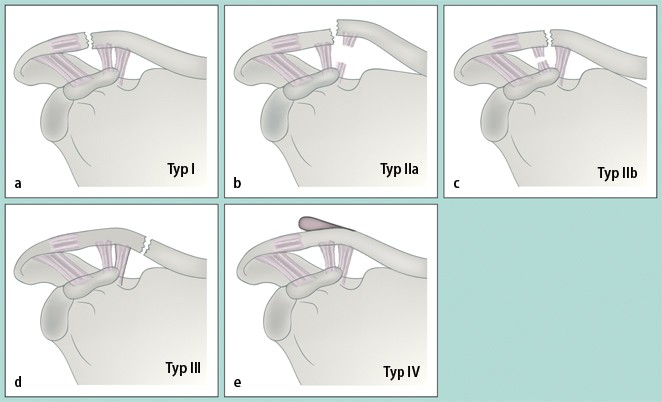
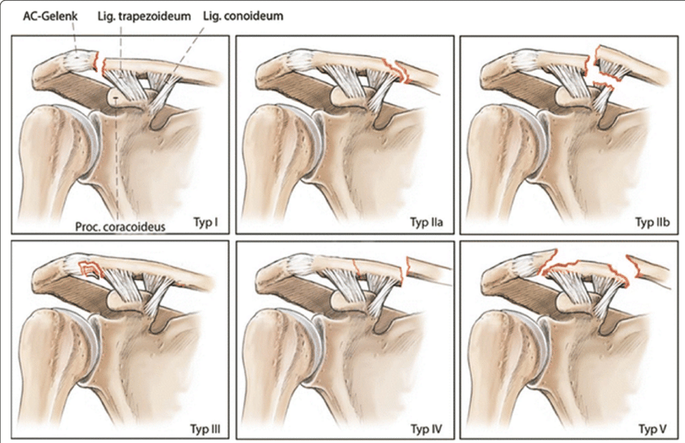
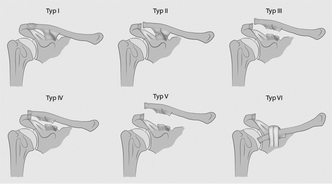
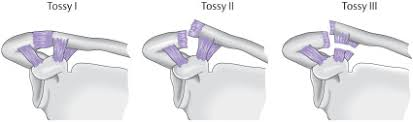

# *Clavicula*

## Jäger-Breitner

- **I:** stabile Fraktur, intakte Bänder 
- **IIa:** instabile Fraktur + Dislokation bei Verletzung der korakoklavikulären Bänder 
- **IIb:** stabile Fraktur ohne Dislokation bei intakter Pars coroidea 
- **III:** laterale Fraktur knapp medial der CC-Bänder 
- **IV:** Luxation des distalen Klavikulaendes aus dem Periost 

## Neer

- **Typ I**: Stabile Fraktur lateral des Ligamentum coracoclaviculare mit minimaler Dislokation und intakten Bändern.
- **Typ II:** Instabile Fraktur mit kranialer Dislokation des medialen Fragmentes durch Zug des Musculus sternocleidomastoideus
  - **Typ IIa:** Medial zum intakten Ligamentum coracoclaviculare.
  - **Typ IIb:** Fraktur innerhalb des Ligamentum coracoclaviculare. Ligamentum conoideum rupturiert, Ligamentum trapezoideum intakt.
  - **Typ IIIc (modifiziert nach Craig):** Fraktur lateral des rupturierten Ligamentum coracoclaviculare.
- **Typ III:** Stabile intraartikuläre Fraktur mit Beteiligung des Akromioklavikulargelenks und intaktem Ligamentum coracoclaviculare.
- **Typ IV:** Kindliche stabile Epiphysenfugenfraktur Salter-Harris Typ 1 mit Dislokation des medialen Fragments nach superior, da die Periosthülle von der inferioren Kortikalis abgerissen wird ("periostales Stripping"). Intaktes Ligamentum coracoclaviculare.
- **Typ V:** Instabile Trümmerfraktur mit medialer Dislokation. Das inferiore Fragment ist mit dem intakten Ligamentum coracoclaviculare verbunden.

# *AC-Gelenk*

## Rockwood

- **I:** Distorsion 
- **II:** Ruptur AC-Bänder, Zerrung CC-Bänder --> Subluxation 
- **III:** Ruptur AC- & CC-Bänder --> Luxation 
- **IV:** Klavikula in Horizontalebene luxiert 
- **V:** Ausgedehnter Klavikulahochstand mit Ablösung d. trapeziodeltoidalen Faszie, Instabilität in allen Richtungen 
- **VI:** Verhakung der Klavikula unter dem Coracoid 

## Tossy

- **Tossy I:** Überdehnung/Zerrung des Ligamentum acromioclaviculare und des Ligamentum coracoclaviculare
- **Tossy II:** Ruptur des Ligamentum acromioclaviculare und Überdehnung des Ligamentum coracoclaviculare ([Subluxation](https://flexikon.doccheck.com/de/Subluxation))
- **Tossy III:** Ruptur beider Bänder mit resultierender Luxation im AC-Gelenk

# SC-Gelenk

## Allmann-Klassifikation

- **Typ I:** Kontusion / Distorsion, Gelenk stabil
- **Typ II:** Subluxation durch partielle Zerreißung der sternoklavikularen Bänder. Kostoklaviculäres Band intakt.
- **Typ III:** Luxation, komplette Zerreißung aller Bänder inklusive Diskus
