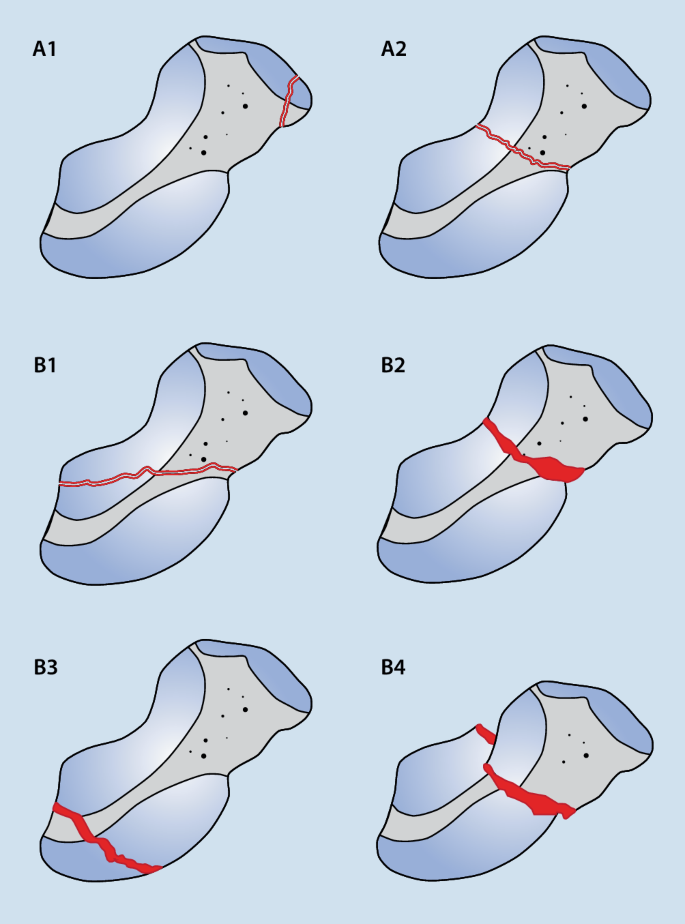
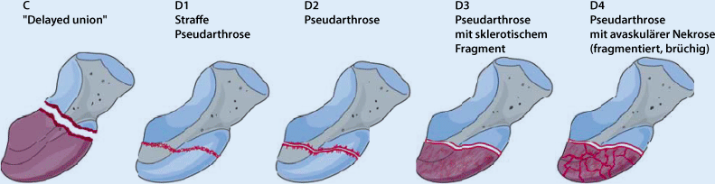

# Handwurzel

## Scaphoidfraktur

### Krimmer & Herbert

**Typ A:** stabile Frakturen 

- **A1** Fraktur des Tuberculum ossis scaphoidei 
- **A2** nicht dislozierte oder inkomplette Fraktur im mittleren/distalen Drittel. 

 **Typ B:** instabile Frakturen:  

- **B1**  Schrägfraktur 
- **B2**  dislozierte Fraktur 
- **B3**  Fraktur im proximalen Drittel 
- **B4**  transskaphoidale perilunäre Luxationsfraktur 

**Typ C:** verzögert heilende Fraktur jeglicher Lokalisation

**Typ D:** Pseudarthrose 

- **D1:** straffe Pseudarthrose 

- **D2:** mobile Pseudarthrose 
- **D3:** Pseudarthrose mit sklerotischem Fragment 
- **D4:** Pseudarthrose mit avaskulärem Fragment 

