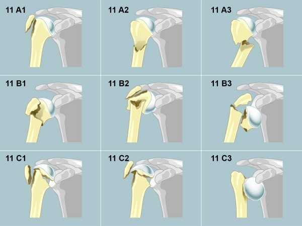

# Proximaler Humerus

### Resch-Klassifikation

- Typ 1: Nondisplaced fracture
- Typ 2: Normal coronal head position but sagittal deformity
- Typ 3: Valgus fractures
- Typ 4: Varus fractures
- Typ 5: Fracture dislocations

The fracture type is further combined with an assessment of the main fractured fragments (G for greater tuberosity, L for lesser tuberosity)

### AO-Klassifikation

 **11 A: Extraartikuläre unifokale 2-Segment-Frakturen:** 

- **11 A1:** Avulsion/Abriss des Tuberculum majus 
- **11 A2:** Fraktur des Collum chirurgicum, impaktiert 
- **11 A3:** Fraktur des Collum chirurgicum, nicht impaktiert 

 

**11 B: Extraartikuläre bifokale 3-Segment-Frakturen:** 

- **11 B1:** metaphysär impaktiert (am Collum chirurgicum) 
- **11 B2:** ohne metaphyseale Impaktierung 
- **11 B3:** mit glenohumeraler Dislokation 

 

**11 C: Artikuläre Frakturen (Collum-anatomicum-Frakturen):** 

- **11 C1:**mit geringer Dislokation 
- **11 C2:** impaktiert mit deutlicher Dislokation 
- **11 C3:** Intraartikuläre Luxationsfraktur 
