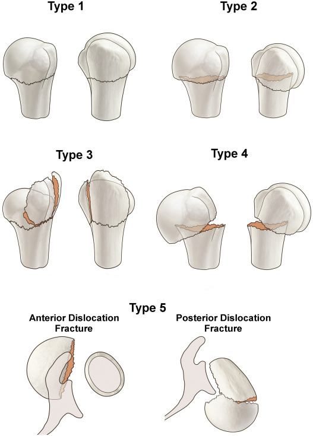

# Proximaler Humerus

### Resch-Klassifikation

- Typ 1: Nondisplaced fracture
- Typ 2: Normal coronal head position but sagittal deformity
- Typ 3: Valgus fractures
- Typ 4: Varus fractures
- Typ 5: Fracture dislocations

The fracture type is further combined with an assessment of the main fractured fragments (G for greater tuberosity, L for lesser tuberosity)

