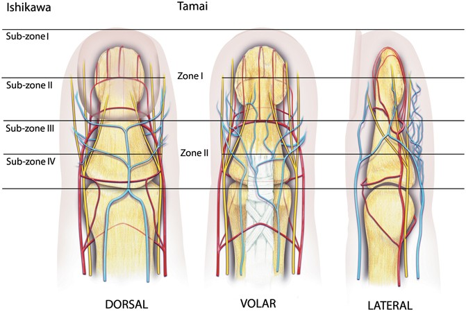

# Finger

## Fingerkuppenamputation - Ishikawa

- **Subzone I:** From the tip of the fingertip to the midpoint of the nail. 

  In 1997, Naiem S Moiemen & David Elliot (UK) modified Ishikawa Classification by dividing subzone I into:  

  - **IA** – from tip of the fingertip to the distal end of the nail (which could be resutured as a composite graft in children).
  - **IB** – from the distal end to the midpoint of the nail.

- **Subzone II** – From the midpoint of the nail to the base of the nail.

- **Subzone III** – From the nail base to the midpoint between nail base and the DIP joint.

- **Subzone IV** – From the midpoint between the nail base and the DIP joint to the DIP joint.
