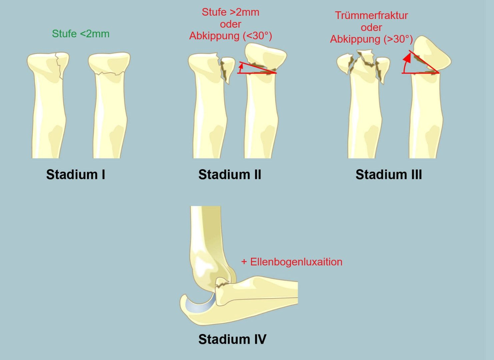
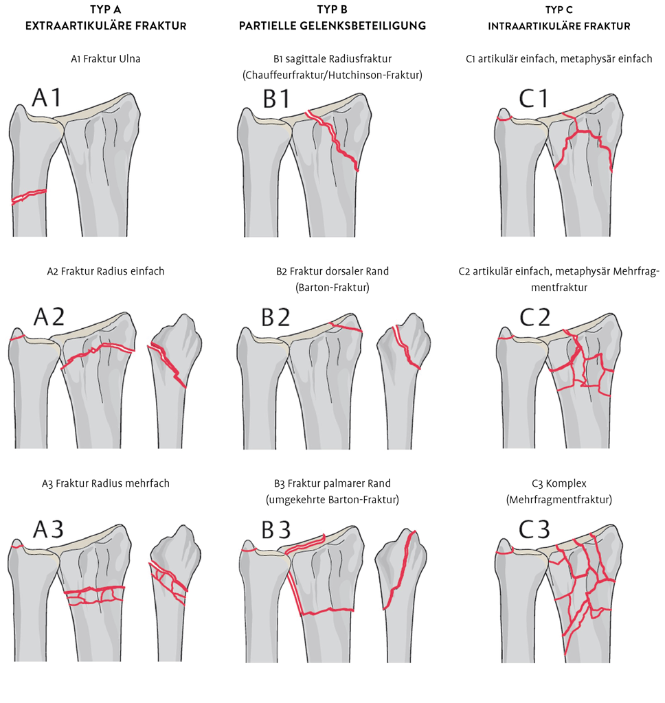
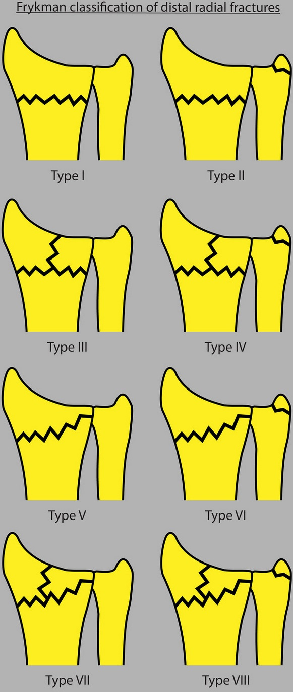
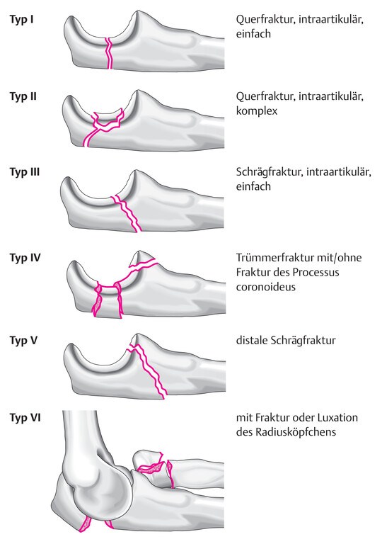
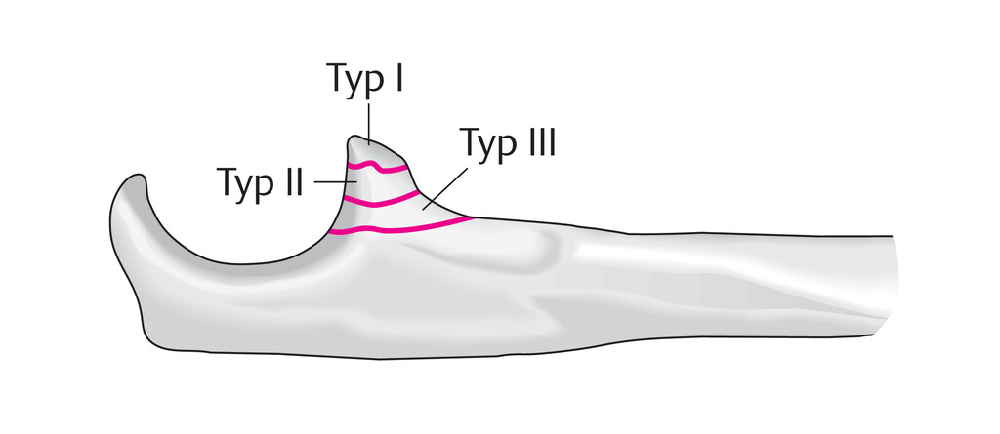
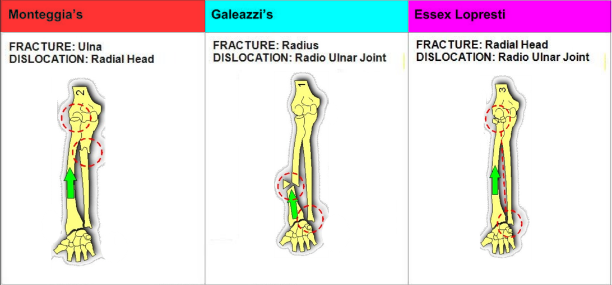
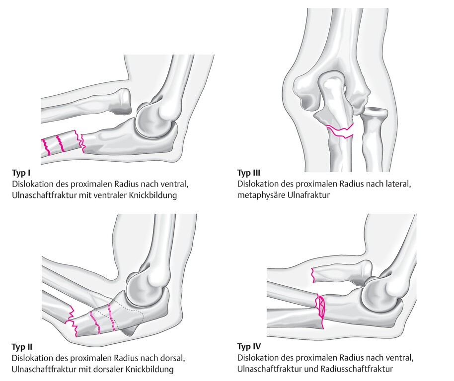
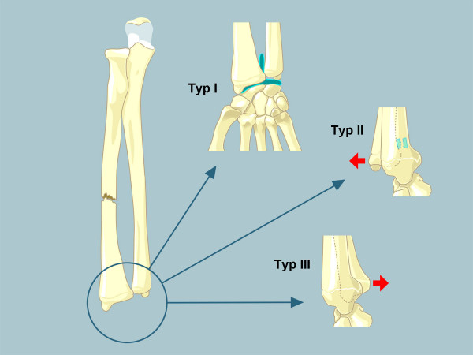
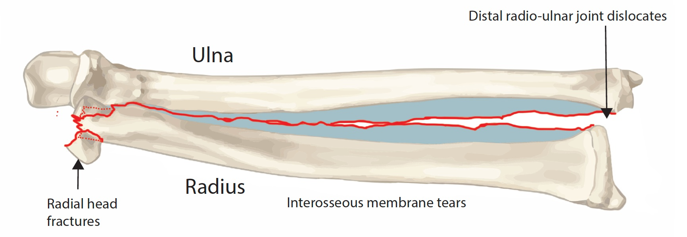

# Radius

## Radiusköpfchen - Mason-Klassifikation

## Distaler Radius

### AO-Klassifikation

### Frykman Klassifikation

- **Typ I:** transverse metaphyseal fracture
- **Typ II**: Typ I + ulnar styloid fracture
- **Typ III:** fracture involves the radiocarpal joint
- **Typ IV:** Typ III + ulnar styloid fracture
- **Typ V**: transverse fracture involves distal radioulnar joint
- **Typ VI**: Typ V + ulnar styloid fracture
- **Typ VII**: comminuted fracture with the involvement of both the radiocarpal and radioulnar joints
- **Typ VIII**: Typ VII + ulnar styloid fracture

# Ulna

## Olecranon - Schatzker Klassifikation

- **Typ I:** Querfraktur 
- **Typ II:** Querfraktur mit Impaktion 
- **Typ III:** Schrägfraktur 
- **Typ IV:** Mehrfragmentfraktur 
- **Typ V:** distale Schrägfraktur 
- **Typ VI:** Luxationsfraktur 

## Proc. Coronoideus - Regan & Morrey

- **Typ I:** Abriss der Koronoidspitze 
- **Typ II:** Fragment <50% 
- **Typ III:** Fragment >50% 

# Kombination Radius & Ulna

## Monteggia Fraktur - Bado Klassifikation

--> proximale Ulna# + Luxation Radiusköpfchen

## Galeazzi Fraktur 

--> Radiusschaft# + Luxation distale Ulna

## Essex-Lopresti

--> Radiusköpfchen/-hals + Luxation der distalen Ulna

